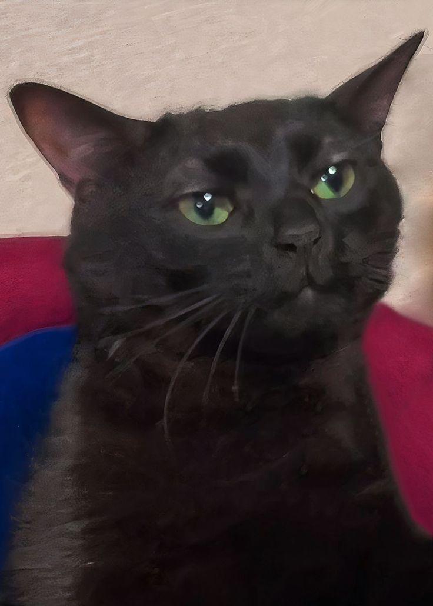

<h2 align="left">Hi 👋! I'm quentin</h2>
<h3 align="left">42 student (campus 19 Bruxelle)</h3>

- 🔭 I’m currently working on **minirt 42 project**

- 🌱 I’m currently learning **Rateracing**

- 📫 How to reach me **quentin.alpesse@student.s19.be**

<h2 align="left">Stats</h2>

  

<h2 align="left">Tech Stack</h2>

  
  
  
  
  
  
  
  
  
  
  
  
  
  
  
  
  
  

<h2 align="left">Connect with me :)</h2>

  

 

